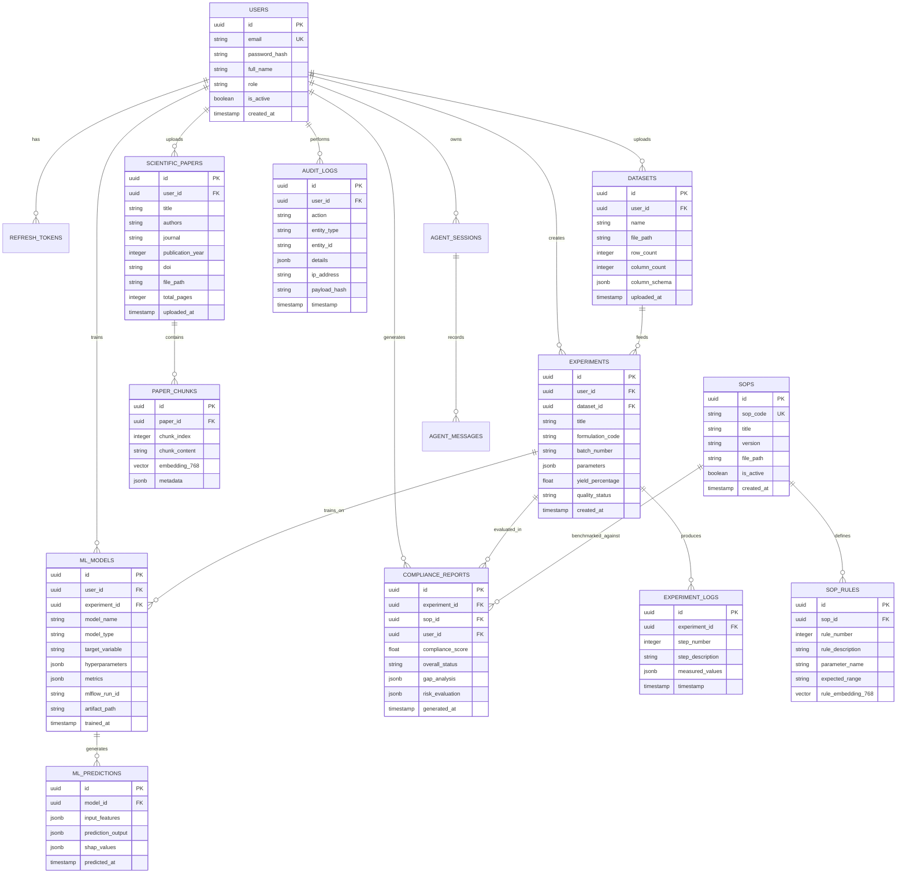

# Database Schema Specification – PharmaGen AI (PostgreSQL + pgvector)

## 1. Relational & Vector ER Diagram



---

## 2. Complete PostgreSQL DDL Specifications

```sql
-- Enable Required Extensions
CREATE EXTENSION IF NOT EXISTS "uuid-ossp";
CREATE EXTENSION IF NOT EXISTS "vector";
CREATE EXTENSION IF NOT EXISTS "pg_trgm";

-- -----------------------------------------------------------------------------
-- 1. USERS & AUTHENTICATION
-- -----------------------------------------------------------------------------
CREATE TYPE user_role AS ENUM ('ADMIN', 'LEAD_RESEARCHER', 'RESEARCH_SCIENTIST', 'AUDITOR');

CREATE TABLE users (
    id UUID PRIMARY KEY DEFAULT uuid_generate_v4(),
    email VARCHAR(255) UNIQUE NOT NULL,
    password_hash VARCHAR(255) NOT NULL,
    full_name VARCHAR(255) NOT NULL,
    role user_role NOT NULL DEFAULT 'RESEARCH_SCIENTIST',
    is_active BOOLEAN NOT NULL DEFAULT TRUE,
    created_at TIMESTAMP WITH TIME ZONE DEFAULT CURRENT_TIMESTAMP,
    updated_at TIMESTAMP WITH TIME ZONE DEFAULT CURRENT_TIMESTAMP
);

CREATE TABLE refresh_tokens (
    id UUID PRIMARY KEY DEFAULT uuid_generate_v4(),
    user_id UUID NOT NULL REFERENCES users(id) ON DELETE CASCADE,
    token_hash VARCHAR(255) UNIQUE NOT NULL,
    expires_at TIMESTAMP WITH TIME ZONE NOT NULL,
    is_revoked BOOLEAN NOT NULL DEFAULT FALSE,
    created_at TIMESTAMP WITH TIME ZONE DEFAULT CURRENT_TIMESTAMP
);

-- -----------------------------------------------------------------------------
-- 2. SCIENTIFIC PAPER INTELLIGENCE (pgvector)
-- -----------------------------------------------------------------------------
CREATE TABLE scientific_papers (
    id UUID PRIMARY KEY DEFAULT uuid_generate_v4(),
    user_id UUID NOT NULL REFERENCES users(id) ON DELETE CASCADE,
    title VARCHAR(512) NOT NULL,
    authors TEXT,
    journal VARCHAR(255),
    publication_year INT,
    doi VARCHAR(255),
    file_path VARCHAR(1024) NOT NULL,
    total_pages INT,
    uploaded_at TIMESTAMP WITH TIME ZONE DEFAULT CURRENT_TIMESTAMP
);

CREATE TABLE paper_chunks (
    id UUID PRIMARY KEY DEFAULT uuid_generate_v4(),
    paper_id UUID NOT NULL REFERENCES scientific_papers(id) ON DELETE CASCADE,
    chunk_index INT NOT NULL,
    chunk_content TEXT NOT NULL,
    embedding VECTOR(768), -- Gemini text-embedding-004
    metadata JSONB DEFAULT '{}'::jsonb,
    created_at TIMESTAMP WITH TIME ZONE DEFAULT CURRENT_TIMESTAMP
);

-- Create HNSW Vector Index for Fast Cosine Similarity
CREATE INDEX idx_paper_chunks_embedding ON paper_chunks 
USING hnsw (embedding vector_cosine_ops) 
WITH (m = 16, ef_construction = 64);

-- Full text search index
CREATE INDEX idx_paper_chunks_fts ON paper_chunks USING gin (to_tsvector('english', chunk_content));

-- -----------------------------------------------------------------------------
-- 3. DATASETS & EXPERIMENTS
-- -----------------------------------------------------------------------------
CREATE TABLE datasets (
    id UUID PRIMARY KEY DEFAULT uuid_generate_v4(),
    user_id UUID NOT NULL REFERENCES users(id) ON DELETE CASCADE,
    name VARCHAR(255) NOT NULL,
    file_path VARCHAR(1024) NOT NULL,
    row_count INT NOT NULL,
    column_count INT NOT NULL,
    column_schema JSONB NOT NULL,
    uploaded_at TIMESTAMP WITH TIME ZONE DEFAULT CURRENT_TIMESTAMP
);

CREATE TABLE experiments (
    id UUID PRIMARY KEY DEFAULT uuid_generate_v4(),
    user_id UUID NOT NULL REFERENCES users(id) ON DELETE CASCADE,
    dataset_id UUID REFERENCES datasets(id) ON DELETE SET NULL,
    title VARCHAR(255) NOT NULL,
    formulation_code VARCHAR(100) NOT NULL,
    batch_number VARCHAR(100) NOT NULL,
    parameters JSONB NOT NULL DEFAULT '{}'::jsonb,
    yield_percentage NUMERIC(5, 2),
    quality_status VARCHAR(50),
    created_at TIMESTAMP WITH TIME ZONE DEFAULT CURRENT_TIMESTAMP
);

CREATE TABLE experiment_logs (
    id UUID PRIMARY KEY DEFAULT uuid_generate_v4(),
    experiment_id UUID NOT NULL REFERENCES experiments(id) ON DELETE CASCADE,
    step_number INT NOT NULL,
    step_description TEXT NOT NULL,
    measured_values JSONB NOT NULL DEFAULT '{}'::jsonb,
    timestamp TIMESTAMP WITH TIME ZONE DEFAULT CURRENT_TIMESTAMP
);

-- -----------------------------------------------------------------------------
-- 4. MACHINE LEARNING & PREDICTIONS
-- -----------------------------------------------------------------------------
CREATE TABLE ml_models (
    id UUID PRIMARY KEY DEFAULT uuid_generate_v4(),
    user_id UUID NOT NULL REFERENCES users(id) ON DELETE CASCADE,
    experiment_id UUID REFERENCES experiments(id) ON DELETE SET NULL,
    model_name VARCHAR(255) NOT NULL,
    model_type VARCHAR(100) NOT NULL, -- xgboost, lightgbm, catboost
    target_variable VARCHAR(100) NOT NULL,
    hyperparameters JSONB NOT NULL DEFAULT '{}'::jsonb,
    metrics JSONB NOT NULL DEFAULT '{}'::jsonb,
    mlflow_run_id VARCHAR(255),
    artifact_path VARCHAR(1024),
    trained_at TIMESTAMP WITH TIME ZONE DEFAULT CURRENT_TIMESTAMP
);

CREATE TABLE ml_predictions (
    id UUID PRIMARY KEY DEFAULT uuid_generate_v4(),
    model_id UUID NOT NULL REFERENCES ml_models(id) ON DELETE CASCADE,
    input_features JSONB NOT NULL,
    prediction_output JSONB NOT NULL,
    shap_values JSONB,
    predicted_at TIMESTAMP WITH TIME ZONE DEFAULT CURRENT_TIMESTAMP
);

-- -----------------------------------------------------------------------------
-- 5. COMPLIANCE & SOPS
-- -----------------------------------------------------------------------------
CREATE TABLE sops (
    id UUID PRIMARY KEY DEFAULT uuid_generate_v4(),
    sop_code VARCHAR(100) UNIQUE NOT NULL,
    title VARCHAR(255) NOT NULL,
    version VARCHAR(50) NOT NULL,
    file_path VARCHAR(1024) NOT NULL,
    is_active BOOLEAN NOT NULL DEFAULT TRUE,
    created_at TIMESTAMP WITH TIME ZONE DEFAULT CURRENT_TIMESTAMP
);

CREATE TABLE sop_rules (
    id UUID PRIMARY KEY DEFAULT uuid_generate_v4(),
    sop_id UUID NOT NULL REFERENCES sops(id) ON DELETE CASCADE,
    rule_number INT NOT NULL,
    rule_description TEXT NOT NULL,
    parameter_name VARCHAR(100),
    expected_range VARCHAR(100),
    rule_embedding VECTOR(768)
);

CREATE INDEX idx_sop_rules_embedding ON sop_rules 
USING hnsw (rule_embedding vector_cosine_ops) 
WITH (m = 16, ef_construction = 64);

CREATE TABLE compliance_reports (
    id UUID PRIMARY KEY DEFAULT uuid_generate_v4(),
    experiment_id UUID NOT NULL REFERENCES experiments(id) ON DELETE CASCADE,
    sop_id UUID NOT NULL REFERENCES sops(id) ON DELETE CASCADE,
    user_id UUID NOT NULL REFERENCES users(id) ON DELETE CASCADE,
    compliance_score NUMERIC(5, 2) NOT NULL,
    overall_status VARCHAR(50) NOT NULL, -- COMPLIANT, NON_COMPLIANT, WARNING
    gap_analysis JSONB NOT NULL,
    risk_evaluation JSONB NOT NULL,
    generated_at TIMESTAMP WITH TIME ZONE DEFAULT CURRENT_TIMESTAMP
);

-- -----------------------------------------------------------------------------
-- 6. 21 CFR PART 11 AUDIT LOGGING
-- -----------------------------------------------------------------------------
CREATE TABLE audit_logs (
    id UUID PRIMARY KEY DEFAULT uuid_generate_v4(),
    user_id UUID REFERENCES users(id) ON DELETE SET NULL,
    action VARCHAR(100) NOT NULL,
    entity_type VARCHAR(100) NOT NULL,
    entity_id VARCHAR(255) NOT NULL,
    details JSONB NOT NULL,
    ip_address VARCHAR(45),
    payload_hash VARCHAR(64) NOT NULL, -- SHA-256 integrity check
    timestamp TIMESTAMP WITH TIME ZONE DEFAULT CURRENT_TIMESTAMP
);

-- -----------------------------------------------------------------------------
-- 7. LANGGRAPH AGENT SESSIONS
-- -----------------------------------------------------------------------------
CREATE TABLE agent_sessions (
    id UUID PRIMARY KEY DEFAULT uuid_generate_v4(),
    user_id UUID NOT NULL REFERENCES users(id) ON DELETE CASCADE,
    title VARCHAR(255) NOT NULL,
    session_state JSONB NOT NULL DEFAULT '{}'::jsonb,
    created_at TIMESTAMP WITH TIME ZONE DEFAULT CURRENT_TIMESTAMP,
    updated_at TIMESTAMP WITH TIME ZONE DEFAULT CURRENT_TIMESTAMP
);

CREATE TABLE agent_messages (
    id UUID PRIMARY KEY DEFAULT uuid_generate_v4(),
    session_id UUID NOT NULL REFERENCES agent_sessions(id) ON DELETE CASCADE,
    agent_name VARCHAR(100) NOT NULL,
    role VARCHAR(50) NOT NULL, -- user, assistant, system, tool
    content TEXT NOT NULL,
    tool_calls JSONB,
    created_at TIMESTAMP WITH TIME ZONE DEFAULT CURRENT_TIMESTAMP
);
```

---

## 3. Vector Indexing & Performance Tuning

### 3.1 `pgvector` HNSW Index Strategy
- **Index Type**: Hierarchical Navigable Small World (HNSW) graphs.
- **Distance Operator**: `vector_cosine_ops` (Cosine distance).
- **Parameters**: `m = 16` (number of bi-directional links per node), `ef_construction = 64` (size of dynamic candidate list during construction).
- **Query Time Tuning**: `SET hnsw.ef_search = 40;` configured per backend database connection session.

### 3.2 Relational Indexing Strategy
- B-Tree indexes on all foreign key constraints (`user_id`, `paper_id`, `experiment_id`, `sop_id`).
- Hash indexes on static lookup fields (`formulation_code`, `batch_number`, `sop_code`).
- Trigram GIN indexes (`pg_trgm`) on scientific paper titles and authors for fuzzy substring search.
